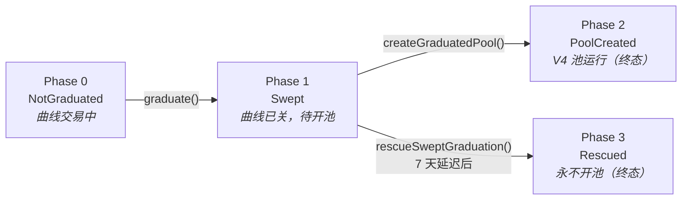

# Pons V2 索引器蓝图

> 面向 ponsfamily.com 同类产品的后端数据层完整设计：链上事件目录、索引器架构、82 张数据库表、派生指标算法与前端接口契约。
>
> 基于 `contractsV2` 源码逐行分析（5,101 行 / 16 文件）+ ponsfamily.com 线上实测（launchpad · analytics · create · docs/v2）。
> 所有 `topic0` 为本地 `cast sig-event` 实算值。

| 项 | 值 |
| --- | --- |
| 链 | Robinhood Chain · Chain ID 4663 |
| 事件 | 67 个自有 + 5 个外部 |
| 数据库表 | 82 |
| 日期 | 2026-09-03（2026-09-04 修订：补齐 Escrow 与 LaunchAndBuy）|

---

## 目录

- [§0 关键发现](#0-关键发现)
- [§1 数据源与合约地址](#1-数据源与合约地址)
- [§2 事件目录](#2-事件目录)
- [§3 索引器架构](#3-索引器架构)
- [§4 数据库设计 · 82 张表](#4-数据库设计--82-张表)
- [§5 派生指标算法](#5-派生指标算法)
- [§6 API 契约](#6-api-契约)
- [§7 陷阱清单](#7-陷阱清单)
- [§8 实施路线](#8-实施路线)

---

## 0. 关键发现

在动工之前，有四项实测结论会直接改变后端的设计与排期。

### 发现 1 · 仓库代码比线上部署旧，狙击税缺失

V2 已上线（Factory `0x7eD598BcEf8bd9Edd8C97A195C6d13f40801EC7e`），而官方 v2 文档明确描述了一套**正在运行的狙击税**：开盘 99%、指数衰减、约 1 秒 25%、2 秒 3%，提供 `currentSnipeTaxBps(recipient)` 读取函数，并支持最多 32 个豁免钱包。

但本仓库的 `PonsV2BondingCurve` **完全没有这段逻辑**：`buy()` 里没有按时间衰减的税、`LaunchDeployment` 不携带 `snipeTaxStartBps`/`snipeTaxSeconds`、`snipeTaxExempt` 映射从不被读取。

**2026-09-04 复核：仍未补齐。** 本轮新增了 `V2FeeEscrow` 与 `PonsV2LaunchAndBuy`（见发现 2），但曲线未被修改 —— `grep` 确认 `currentSnipeTaxBps`、时间衰减逻辑、以及 `LaunchDeployment` 中的 `snipeTaxStartBps`/`snipeTaxSeconds` 字段**全部仍不存在**。曲线里只有一个 `exemptFromSnipeTax` setter 与从不被读取的 `snipeTaxExempt` 映射。

**对后端的直接影响**：文档说明狙击税被**合并进 `CurveBuy.fee` 字段**。因此仅凭事件**无法**把基础费与狙击税拆开。要展示"狙击税收入"必须在索引时按 `block.timestamp − launch_ts` 重算衰减曲线，或对每个区块调用 `currentSnipeTaxBps`。**ABI 必须从链上已验证的合约拉取，不能用本仓库的产物。**

### 发现 2 · 三个缺失合约中已补齐两个（2026-09-04 修订）

| 合约 | 地址 | 状态 | 说明 |
| --- | --- | --- | --- |
| **V2FeeEscrow** | `0xd3AFEB2a57f70eF218Aa82451c51B2fb0416Ac9e` | ✅ **已补齐** | 源码已入库 `src/v2/V2FeeEscrow.sol`。4 个事件签名已确认（见 §2.6）。**`Credited`/`CreditedToken` 带 indexed `depositor`，直接解决了收入归属的推断问题** |
| **PonsV2LaunchAndBuy** | `0xe33E9E479dF8802cb0866d5d05258bEc4cF62948` | ✅ **已补齐** | 源码已入库 `src/v2/PonsV2LaunchAndBuy.sol`。即 `launchForwarder`。2 个事件已确认。**引入了一个重要的索引陷阱，见 §2.6 与陷阱 #19** |
| **Holder fee splitter** | 未知地址 | ❌ **仍缺失** | 创建页有 "Holder fee sharing：把创作者费用按持仓比例分给持币人" 开关，仓库合约里**完全没有**这个机制。推测是一个被设为 `creatorFeeRecipient` 的分账合约。**仍需向对方索取地址与 ABI**，否则这类代币的创作者费用流向会在数据上断链。 |

> **附带发现：`src/v2/interfaces/IV2FeeEscrow.sol` 是死代码。**
> 它把 `ILaunchpadV2.sol` 的 `FeePolicySnapshot`、`GraduationPhase`、`IV2LaunchFactory`、`IV2BondingCurve` 等类型以 `IV2*` 前缀重复声明了一遍，但**没有任何文件 import 它**（`V2FeeEscrow.sol` 导入的是 `ILaunchpadV2.sol` 里新加的那份 `IV2FeeEscrow`）。因为两份声明分处不同文件且未被同时导入，Solidity 允许，`forge build` 通过。但它是一个真实的维护隐患：以后改 `ILaunchpadV2.sol` 的结构体很容易漏改这一份。**建议删除该文件，或反过来让 `ILaunchpadV2.sol` 从它导入。** 索引器不受影响。

### 发现 3 · 线上站点当前跑的是 V1，不是 V2

公开文档主线描述的是 V1：Uniswap **V3**、"没有债券曲线、之后也不迁移"、固定供应 1e9、池费 1%、毕业阈值 4.2 ETH、创作者/协议 70/30。V2 文档在独立的 `/docs/v2` 路径下。站点顶部横幅写着"正在为新版本升级后端"。

**影响**：如果新产品要同时展示历史数据，索引器必须**双版本并行**。注意 `TokenLaunched` 在两版中签名不同 —— V1 的 topic0 是 `0xdb51ea9a…`，V2 实算为 `0x8d4aad49…`，**解码器不能共用**。

### 发现 4 · 对方没有公开 API，这是产品机会

实测 `/api/*` 全部 404，`api.` / `indexer.` / `graph.` 子域均不解析。数据走 Next.js 服务端渲染，聚合指标外包给 Dune（analytics 页显示 "Dune history is unavailable"、两个指标都是 0）。官方文档立场是"信任路径里没有 pons API，请自行索引 factory 和 curve"。

换言之：**他们没有实时聚合层，我们自建索引器可以在数据新鲜度、K 线粒度、持仓与 PnL 上直接超过对方**。这也是本设计把时序与账户维度做厚的原因。

补齐 Escrow 源码后这一点更成立：收入账本的事件结构已完全明确，Profile 页的"可领取收益"可以做到实时准确，而不必依赖 `eth_call` 轮询 `balanceOf`。

---

## 1. 数据源与合约地址

链上 9 个自有合约 + 2 个 Uniswap 单例 + 每个发射动态产生的 1 个曲线合约。

### 1.1 网络

| 项 | 值 |
| --- | --- |
| Chain ID | `4663` |
| 公共 RPC | `https://rpc.mainnet.chain.robinhood.com` |
| 浏览器 | `robinhoodchain.blockscout.com` |
| 原生资产 | ETH（`pairToken == address(0)` 表示原生腿） |
| WETH（V1 报价） | `0x0Bd7D308f8E1639FAb988df18A8011f41EAcAD73` |

**务必自建归档节点或付费 RPC。** 公共 RPC 不保证 `eth_getLogs` 的区块跨度与历史深度，回填 800 万+ 区块会被限流。同时需要确认该链的**最终性模型**（PoA / 单排序器 / 有无 L1 结算），它直接决定 §3.2 重组策略的 `SAFE_DEPTH`。

### 1.2 V2 合约（Robinhood Chain）

| 合约 | 地址 | 索引 | 说明 |
| --- | --- | --- | --- |
| **PonsV2LaunchFactory** | `0x7eD598BcEf8bd9Edd8C97A195C6d13f40801EC7e` | P0 | 唯一入口，发现所有曲线 |
| **PonsV2MemeHook** | `0xE5e702641Ea86F4ae6cC3cDaeD2B886f976Be044` | P0 | 池期抽费 + 全局费率政策 |
| **V2FeeEscrow** | `0xd3AFEB2a57f70eF218Aa82451c51B2fb0416Ac9e` | P0 | 收入账本 · 源码已入库 |
| **PonsV2BuybackVault** | `0x42df2a798f82289E177311362e8f5ccC45c1219c` | P1 | 五年归属 |
| **PonsV2LaunchLocker** | `0x267444D099b10fB5Ed7c3Cc7B7c767AdcA574952` | P1 | 锁仓证明 |
| **PonsV2LaunchAndBuy** | `0xe33E9E479dF8802cb0866d5d05258bEc4cF62948` | **P0** | 发射即买入 · 源码已入库 · **首单归因必需** |
| **PonsV2GraduationExecutor** | `0xC7819B64A1dAECD7eC19856d026cb14EfBd89046` | P2 | 仅尘埃事件 |
| **PonsV2LaunchDeployer** | `0x3711ceA4feaDE896C913C68F01Eda97Cb06D1A42` | — | 无事件 |
| **PonsV2GraduationGuard** | `0xf5695117b99B6f6401e67d4195BD653628176C6C` | — | 无状态纯函数 |
| **V4 PoolManager** | 需从链上确认 | P0 | 单例，**必须按 poolId 过滤** |
| **V4 PositionManager** | 需从链上确认 | P2 | 仓位 NFT |
| **每个发射的 Curve** | 动态（CREATE2） | P0 | 从 `TokenLaunched` 发现 |
| **每个发射的 Token** | 动态（CREATE2） | P0 | ERC-20 `Transfer` → 持仓 |

### 1.3 链下数据源

| 源 | 用途 | 落表 |
| --- | --- | --- |
| **ETH/USD 价格源** | 所有 USD 计价的唯一依赖。需分钟级历史，用于回填时按交易时刻取价 | `price_feeds` |
| **ERC-20 报价资产元数据** | `symbol`/`name`/`decimals`，以及该资产自身的 USD 价 | `pair_tokens` |
| **代币图片** | `logo()` 返回 URL（可能是 IPFS/任意 URL）。**必须转存到自有 CDN + 内容审核**，不可直接把用户可控 URL 渲染给前端 | `image_assets` |
| **合约 ABI** | 从 Blockscout 拉已验证 ABI，而非本仓库编译产物（曲线的狙击税仍缺，见 §0 发现 1） | `contract_registry` |

---

## 2. 事件目录

自有合约 67 个事件声明（61 个唯一名），加外部合约 5 个。topic0 为本地实算值。

优先级：**P0** 核心业务不可缺 · **P1** 完整性与运营 · **P2** 可延后。

> **重名警告**
>
> `CreatorFeeRecipientUpdated`、`BuybackEnabledUpdated`、`FactorySet` 在多个合约中**重名且签名不同**，topic0 也不同。解码路由必须按 `(address, topic0)` 二元组，绝不能只按事件名。

### 2.1 PonsV2LaunchFactory — 23 个

| 事件 | topic0 | 级 | 用途与落表 |
| --- | --- | --- | --- |
| **TokenLaunched**<br>`(address idx token, address idx curve, address idx deployer, address pairToken, uint256 launchConfigId, uint256 graduationThreshold)` | `0x8d4aad4953d0ca700d468f3753aa14432d1b35b43ec6409f051fb6aa43a89607` | P0 | **索引器的起点。** 插入 `tokens`，并**动态注册 curve 与 token 地址**到监听列表。同 tx 内需 `eth_call` 补齐 name/symbol/decimals/supply/logo/socials 与 `getLaunchFeePolicy` |
| **LaunchSwept**<br>`(address idx token, uint256 quoteOut, uint256 tokenOut)` | `0xcdb72f157fd3666758a6ce201387ffb52038c7562e4fff352828da1096c4b6b4` | P0 | phase → `Swept`。落 `graduations`。**`quoteOut` 是 Factory 实测到账量**，可能小于曲线 `trackedQuote` |
| **PoolGraduated**<br>`(address idx token, uint256 positionId, uint256 tokenAmount, uint256 pairTokenAmount)` | `0x0a44ef75df69c534f43cd6c1aa3ef8983065fe5fe79ef9e79f6494e6f258c259` | P0 | phase → `PoolCreated`。**此刻起价格来源从曲线切换为 V4 池。** 需在同 tx 的 `PoolRegistered` 中拿到 `poolId` |
| **GraduationTokensPermanentlyLocked**<br>`(address idx token, uint256 amount)` | `0xa0a18f5bf205becee8b268d7cf69addab8548ae8ef361791464cf0e0e17c1361` | P0 | **流通量计算必需。** 这部分永久退出流通。恒等式：`LaunchSwept.tokenOut = PoolGraduated.tokenAmount + amount` |
| **LaunchForceSwept**<br>`(address idx token)` | `0x52c1a28345695afc7f6b7629133124dec5d61ee745affd65e4fd2a776bc05840` | P1 | **运营告警。** 与 `LaunchSwept` 同 tx 追加。意味该发射种子被 Guard 判定不可铸造，只能走 7 天救援 |
| **LaunchGraduationRescued**<br>`(address idx token, address idx recipient, uint256 quoteAmount, uint256 tokenAmount)` | `0x7017304fdd491394686dce984eac721f0be1a22228346210f16694772bde44ca` | P1 | phase → `Rescued`（终态，永不开池）。**需前端强提示** |
| **CreatorFeeRecipientUpdated**<br>`(address idx token, address idx prev, address idx new)` | `0x308c390ed1ab5873392818e036cabdf408bc8ad042fbaead3108954ff75ba980` | P0 | 收款人实际变更（自助或覆写执行）。落 `creator_fee_recipient_changes`。**社区接管（CTO）的落地信号** |
| **CreatorFeeRecipientChangeProposed**<br>`(address idx token, address idx current, address idx proposed, uint256 effectiveAt, uint256 expiresAt)` | `0x7f119e44c84a715429bee60d30ad2e14afdef6c60bb1a7eaa01290ecf6d1b2e5` | P0 | Owner 覆写提案（3 天时间锁 + 3 天执行窗口）。落 `creator_recipient_proposals`。**前端需倒计时** |
| **CreatorFeeRecipientChangeCancelled**<br>`(address idx token, address idx proposed)` | — | P1 | 提案取消。注意**被新提案替换时不发此事件**，需按 token 覆盖旧记录 |
| **BuybackEnabledUpdated**<br>`(address idx token, bool enabled, address idx controller)` | `0xbd886f85b7731f66269f57707414d435bf8df930d3357a10becc48a69377f6d5` | P1 | 落 `buyback_toggles`。`enabled=true` 时 `controller` 必为创作者（Owner 只能关） |
| **LaunchConfigAdded** / **LaunchConfigUpdated**<br>`(uint256 idx id)` | — | P0 | **只带 id 不带内容**，必须在该区块 `eth_call getLaunchConfig(id)` 快照进 `launch_config_versions`，否则历史条款不可还原 |
| **PairTokenEconomicsUpdated**<br>`(address idx pairToken, uint256 phantomQuote, uint256 graduationThreshold, uint8 decimals)` | — | P0 | 非原生报价资产的曲线经济参数。**已有发射不受影响**，须按版本存 |
| **PairTokenApprovalUpdated**<br>`(address idx pairToken, bool approved)` | — | P1 | 落 `pair_tokens`，驱动创建页的资产下拉 |
| **LaunchFeeUpdated** · **LaunchEnabledUpdated** · **MaxCreatorTaxUpdated** · **SnipeTaxStartBpsUpdated** · **SnipeTaxSecondsUpdated** | — | P1 | 落 `protocol_params_history`。**狙击税两参数是重算税额的唯一依据**（见 §5.4） |
| **WhitelistedLauncherUpdated**<br>`(address idx launcher, bool enabled)` | — | P2 | 落 `whitelisted_launchers` |
| **GraduationExecutorSet** · **LaunchDeployerSet** · **LaunchForwarderSet** | — | P2 | 落 `contract_registry`，审计用 |

### 2.2 PonsV2BondingCurve — 12 个（每发射一个实例）

这是**交易数据的全部来源**。曲线地址在 `TokenLaunched` 时动态加入监听。实现上不要为每个曲线单独订阅，而是**按 topic0 全量拉取再用地址白名单过滤**（见 §3.1）。

| 事件 | topic0 | 级 | 用途与落表 |
| --- | --- | --- | --- |
| **CurveBuy**<br>`(address idx buyer, address idx recipient, uint256 quoteIn, uint256 tokensOut, uint256 fee, uint256 tax)` | `0xec36bf571f136799e8dc0b0b8bea4b04d8bd3d43de838aab0d5fc21d4cbfc455` | P0 | 落 `curve_trades(side='buy')`。**`quoteIn` 是实际花掉的 `spent`**，非请求量也非收到量。`fee` **含狙击税**。成交均价 `= quoteIn / tokensOut` |
| **CurveSell**<br>`(address idx seller, address idx recipient, uint256 tokensIn, uint256 quoteOut, uint256 fee, uint256 tax)` | `0x8113d738abdcb6b38357e9d53a54a7157861a09031b453651f0fe7fe151f59df` | P0 | 落 `curve_trades(side='sell')`。**`quoteOut` 是扣费后净额**；毛额 `= quoteOut + fee + tax` |
| **CurveBuyRefunded**<br>`(address idx buyer, uint256 refund)` | `0xa69e8258ccc7b9bbb70ab953fc2d1062b4ee28b8ca827534097e1732e87b0262` | P0 | **部分成交标志**（买单撞上 `reservedTokens` 地板）。**在 `CurveBuy` 之前发出**，需按 tx 合并进同一行的 `refund_amount`。它出现即代表**这是该发射的最后一笔买单** |
| **CurveCompleted**<br>`(address recipient, uint256 quoteOut, uint256 tokenOut)` | `0xf8d37a90738ae063b8b8058b66f5880cf3cf7ab0c5d4fa78219696591dfbfb67` | P0 | 曲线永久停止交易。**`recipient` 未 indexed**，无法按它过滤 |
| **FeesSwept**<br>`(uint256 protocolAmount, uint256 buybackAmount, uint256 creatorAmount)` | `0x9f4cd7c4ed99d08a797804560c9c5d71d2cf7e101f2e3b5e7d1ca8a24c370e4f` | P0 | **三个字段全部未 indexed**，只能靠 `log.address` 反查 token。`buybackAmount=0` 表示回购被降级折回创作者 |
| **BuybackLocked**<br>`(uint256 quoteSpent, uint256 tokensLocked)` | `0x5feba9b0d52c92ada4b9c571c2bee52390c54f2947208ab250221e6ee32f12ff` | P1 | 回购真正执行。位于 `FeesSwept` 之前。**代币不销毁**，进五年归属 |
| **AutoGraduationFailed**<br>`(address idx token, uint256 gasRemaining)` | `0xe2cd2f31ebc05ec28640102987f4c8fc5f20e269e1b3aa82577f3f2f0e35c7c6` | P0 | **最高优先级运营告警。** 发射已就绪但未毕业，卖出侧已关闭。需自动触发 keeper 调 `graduate()`。`gasRemaining` 小 ⇒ gas 不足；大 ⇒ 真实故障 |
| **FeesRescued**<br>`(address idx protocolRecipient, address idx creatorRecipient, uint256 protocolAmount, uint256 creatorAmount)` | — | P1 | Owner 救援：**绕过 Escrow 直接转账**。这些收入**不会**出现在 Escrow 事件里，收入统计必须并入 |
| **Initialized**<br>`(address token)` | — | P2 | 与 `TokenLaunched` 同 tx，冗余 |
| **CreatorFeeRecipientUpdated**<br>`(address idx prev, address idx new)` | — | P2 | Factory 事件的下游镜像 |
| **BuybackEnabledUpdated**<br>`(bool enabled)` | — | P2 | 同上 |
| **SnipeTaxExempted**<br>`(address idx account)` | `0xe4b7e48fbd47c2f602bacadee76ad33b16542ddb4997cfc0de04c311adcfa8c7` | P1 | 落 `snipe_tax_exemptions`。**反狙击分析的关键**：可识别"创作者声明的 bundle 钱包"，用于捆绑买入检测 |

### 2.3 PonsV2MemeHook — 16 个

| 事件 | topic0 | 级 | 用途与落表 |
| --- | --- | --- | --- |
| **PoolRegistered**<br>`(PoolId idx poolId, address memecoin, address quoteToken, address creator)` | `0x01bf263a1db1652580721573296e1a1fa70b3d4c87f61d02a69c4e1109d2d573` | P0 | **poolId ↔ token 的唯一映射来源。** 拿到它才能过滤 PoolManager 的 `Swap`。完整费率条款不在事件里，需 `eth_call launches(poolId)` |
| **HookFeeCollected**<br>`(PoolId idx poolId, address currency, uint256 feeAmount, uint256 taxAmount)` | `0xc532c43b3423e14ef72748f1c8291238829ca0af8ba9b67975ad1483485a4b4d` | P0 | 每笔被抽费的 swap。`currency` 是**未指定货币**，可能是 memecoin 也可能是报价资产。Hook 自身内部 swap **不发此事件** |
| **PoolFeesSwept**<br>`(PoolId idx poolId, uint256 protocolAmount, uint256 buybackAmount, uint256 creatorAmount, uint256 tokensLocked)` | `0x2f3c43579b9064b6f28edcf41608f3815792d274a56afe024359703cb4ea9b30` | P0 | `buybackAmount` 是**实际消耗量**，未成交部分已折回 `creatorAmount` |
| **PoolConversionSkipped**<br>`(PoolId idx poolId, uint256 retainedMemecoin)` | `0xeed2d18eb96f3c2cb8c7b6993512a506c170e17d29355f2d7a0d5961f338de09` | P1 | memecoin→报价 兑换撞价格上限、一点未成交。**不是失败**，桶原样还回待重试。累计告警 |
| **PoolBuybackSkipped**<br>`(PoolId idx poolId, uint256 foldedBackQuote)` | `0xbdb9140e5a6bcb57cebdbf44a42f8c0f6c96af972d8f88cc3ae2b974f193bc0d` | P1 | 回购未成交，金额并入创作者 |
| **PoolFeesRescued**<br>`(PoolId idx poolId, address idx quoteToken, uint256 protocolAmount, uint256 creatorAmount)` | `0x0fbb28f9c335f55dcc5cc19e595ab55f9e6a0fd1b58ad77be3a98f99901daaff` | P1 | **按货币各发一次**（报价一次 + memecoin 一次）。第二个参数名叫 `quoteToken` 但实际是"被救援的货币"，memecoin 那次就是 memecoin 地址 |
| **CreatorFeeRecipientUpdated**<br>`(PoolId idx, address idx prev, address idx new)` | `0xb45e6b72a7de9a2077babe9717744436f3880e114099956ca85f91a77469a532` | P2 | Factory 下游镜像。只改即时费用收款人，**不改回购归属受益人** |
| **BuybackEnabledUpdated**<br>`(PoolId idx poolId, bool enabled)` | `0xfebf5d5a892f779904618832d01bf549d0c159d7d0bf88067a8bffbf9ef6e7d4` | P2 | 同上 |
| **ProtocolFeeShareUpdated** · **BuybackBurnBpsUpdated** · **HookFeeBpsUpdated** · **MaxInternalPriceImpactUpdated** · **ProtocolFeeRecipientUpdated** | — | P0 | 落 `fee_policy_history`。**只影响此后的新发射**，已有发射持有快照。`ProtocolFeeRecipient` **同时是发射费收款地址** |
| **FeeSweepOperatorUpdated**<br>`(address operator)` | — | P1 | **唯一实时读取、不走快照的角色**。运营监控需知道当前 operator |
| **FactorySet** · **BuybackVaultSet** | — | P2 | 一次性接线 |

### 2.4 PonsV2BuybackVault — 5 个

| 事件 | topic0 | 级 | 用途 |
| --- | --- | --- | --- |
| **Locked**<br>`(address idx token, address idx depositor, uint256 amount, uint256 newVestingStart)` | `0x967ad762aa9070ada8db64577288e214771e89667066ae38e8750cb8a86c5429` | P1 | `amount` 是**实测到账量**。`newVestingStart` 是重算的加权平均起点，**不能用它插值算归属** |
| **Released**<br>`(address idx token, uint256 creatorAmount, uint256 protocolAmount)` | `0x82e416ba72d10e709b5de7ac16f5f49ff1d94f22d55bf582d353d3c313a1e8dd` | P1 | **参数顺序是 creator 在前**，与其他事件相反，极易解析错 |
| **VestingTermsSnapshotted**<br>`(address idx token, address idx creatorRecipient, address idx protocolRecipient, uint256 protocolFeeShareBps)` | `0xa92f5227e67257769e49f294586ea055f8d5714595dfdcc2d8a0cac8a3e50fbe` | P1 | **仅新纪元发出**。`creatorRecipient` 是金库实际生效值，可能保留此前重定向的地址 |
| **CreatorRecipientUpdated**<br>`(address idx token, address idx prev, address idx new)` | `0x38f9c71383b6e3fe639172c6b3a3d4418fa722b4abf99bfd8e31f92bd5ea23f0` | P2 | **已归属未释放的代币也跟随新收款人** |
| **FactorySet** | — | P2 | — |

### 2.5 Locker 与 Executor — 5 个

| 事件 | topic0 | 级 | 用途 |
| --- | --- | --- | --- |
| **PositionLocked**<br>`(address idx token, uint256 idx tokenId)` | `0x2cabb2a2973327d5863ceb4707e9441851243897e86d587ee35943599752eb54` | P1 | **"流动性已锁"徽章的链上证明**（发出前校验了 `ownerOf`） |
| **TokenSupplyLocked**<br>`(address idx token, uint256 amount)` | `0xaf33c4aba92959b3e7ddc83ab728938262da159a6c05ca836f6c46f9bcb2c740` | P1 | 流通量计算。**Executor 扫来的尘埃不经此路径**，不计入 `lockedTokenSupply` |
| **GraduationDustSwept** / **Retained**<br>`(address idx launchToken, address idx currency, uint256 amount)` | `0x80a5a2ff…` / `0x667636bc…` | P2 | **`amount` 是当时合约总余额，含历次遗留，不是本次增量**。Retained 累计告警 |
| **FactorySet** | — | P2 | — |

### 2.6 V2FeeEscrow 与 PonsV2LaunchAndBuy — 6 个（本轮新增）

#### V2FeeEscrow — 4 个

费用收入的**权威账本**。曲线、Hook、回购金库三者的所有派付都经由它记账，收款人自行 `claim`。

| 事件 | topic0 | 级 | 用途与落表 |
| --- | --- | --- | --- |
| **Credited**<br>`(address idx recipient, address idx depositor, uint256 amount)` | `0x4e45da441832cf53bdaa69235704fc0575e68210f459ee1562911024b12967d5` | P0 | 原生 ETH 入账。落 `escrow_credits`。**`depositor` 是 indexed 的**，可直接判定这笔收入来自曲线 / Hook / 金库 —— 无需再从上游 `*FeesSwept` 反推 `role` |
| **CreditedToken**<br>`(address idx recipient, address idx token, address idx depositor, uint256 amount)` | `0x5d104c62f50449fadfe6f4013c8f36588d32737f94b5ac9b83ddad33b3e1ffdf` | P0 | ERC-20 入账（非原生报价资产的发射）。**`amount` 是实测余额差**，非名义值 —— fee-on-transfer 资产不会让账本记录超过实际持有的负债 |
| **Claimed**<br>`(address idx recipient, uint256 amount)` | `0xd8138f8a3f377c5259ca548e70e4c2de94f129f5a11036a15b69513cba2b426a` | P0 | 原生提现。落 `escrow_claims` |
| **ClaimedToken**<br>`(address idx recipient, address idx token, uint256 amount)` | `0xdbc1ea3a8459e4c7e11fb385b52bbb5cc8c8ab85eec5d883ac9aa78c171f5141` | P0 | ERC-20 提现 |

> **两个必须注意的语义**
>
> 1. **`credit` / `creditToken` 是完全无权限的** —— 任何人都能给任何地址充值（调用者只能加自己已附带的价值，所以合约层面无需设限）。这意味着 `escrow_credits` 里**可能出现与协议无关的第三方充值**。计算协议/创作者收入时**必须按 `depositor ∈ 已知合约集合` 过滤**，否则任何人都能凭空抬高你的收入报表。见陷阱 #20。
> 2. **提现可以是部分的** —— 存在 `claim(amount)` 与 `claimToken(token, amount)` 两个带额度的重载（设计原因是：余额聚合了所有发射的收入，而 `creditToken` 无权限，若某报价资产有单笔转账上限，全额提取会永久 revert）。因此**余额必须按 `credited − claimed` 累计计算**，不能把 `Claimed` 当作"该笔收入已结清"的一次性标记。

#### PonsV2LaunchAndBuy — 2 个

原子化"发射 + 开发者首单"路由器，是 Factory 唯一信任的 `launchForwarder`。

| 事件 | topic0 | 级 | 用途与落表 |
| --- | --- | --- | --- |
| **Launched**<br>`(address idx token, address idx curve, address idx recipient, address launcher, uint256 quoteSpent, uint256 tokensReceived)` | `0xdcacba5e347ae7abd91cb519eb877af8fa7774e347b85dd3ddcd24a2ba8cdf37` | P0 | **首单归因的唯一来源。** 落 `atomic_launches`，并回填 `tokens.launched_via = 'launch_and_buy'` |
| **Rescued**<br>`(address idx asset, address idx recipient, uint256 amount)` | `0x3af790fafda720819b2fc6e15090606e81154e0ac9a92d38ecad006d99d20ecc` | P2 | Owner 取走误转入的滞留资产。落 `periphery_rescues`。正常流程下路由器**不留余额**（两条腿都在同一笔调用内自筹自清），出现即异常 |

> **⚠️ 这是本轮最重要的索引发现：原子发射会让 `CurveBuy.buyer` 变成路由器地址**
>
> 路由器是曲线的实际调用者，所以对每一个经 `launchAndBuy` 的发射，其**首笔** `CurveBuy` 事件里 `buyer` = 路由器合约地址（`0xe33E…2948`），`recipient` = 真实收款人。如果直接把 `buyer` 写进 `curve_trades.trader`，**所有原子发射的开发者首单都会被归因到同一个路由器地址上**，导致：交易者排行榜出现一个巨量的假账户、创作者的"自己买了多少"完全算错、持仓成本无法归属。
>
> **对策**：`curve_trades` 增加 `origin_account` 字段。当 `trader ∈ {已知路由器}` 时，从同 tx 的 `Launched.launcher` 取真实发起人；否则等于 `trader`。所有账户维度的统计（G11）一律用 `origin_account`。

> **另外三个字段级陷阱**
>
> - **`Launched.quoteSpent` 是请求额，不是实付额。** 它就是入参 `quoteIn`。若曲线部分成交（撞上 `reservedTokens` 地板），差额由曲线退给路由器、路由器再退给 `msg.sender`。**实付额只能取同 tx 的 `CurveBuy.quoteIn`。** 两者不等时即为"首单吃满整条曲线"的极端情况。
> - **一次原子发射涉及三个可能互不相同的地址**：`launcher`（发起人，决定 CREATE2 salt 命名空间与发射记录归属）、`recipient`（收币人）、`params.creatorFeeRecipient`（费用受益人）。三者都要落库，不能混用。
> - **路由器会自动把 `recipient` 追加进狙击税豁免列表**，所以 `SnipeTaxExempted` 必然包含首单收款人。同时调用方**最多只能声明 31 个**豁免地址（Factory 的上限是含追加项的 32）。

### 2.7 外部合约事件（5 个）

| 合约 / 事件 | topic0 | 级 | 用途 |
| --- | --- | --- | --- |
| **ERC-20 · Transfer**<br>`(address idx from, address idx to, uint256 value)` | `0xddf252ad1be2c89b69c2b068fc378daa952ba7f163c4a11628f55a4df523b3ef` | P0 | **持仓、持币人数、Top10 集中度、holder 分账快照的唯一来源**。数据量最大的一张表 |
| **V4 PoolManager · Swap**<br>`(PoolId idx id, address idx sender, int128 amount0, int128 amount1, uint160 sqrtPriceX96, uint128 liquidity, int24 tick, uint24 fee)` | `0x40e9cecb9f5f1f1c5b9c97dec2917b7ee92e57ba5563708daca94dd84ad7112f` | P0 | **毕业后的全部行情来源。** 单例合约，**必须用 `poolId` 白名单过滤**，否则会吞下全链所有 V4 池 |
| **V4 PoolManager · Initialize** | `0xdd466e674ea557f56295e2d0218a125ea4b4f0f6f3307b95f85e6110838d6438` | P1 | 开池初始价，落 `pools.sqrt_price_x96_init` |
| **V4 PoolManager · ModifyLiquidity** | `0xf208f4912782fd25c7f114ca3723a2d5dd6f3bcc3ac8db5af63baa85f711d5ec` | P1 | 正常只有毕业那一次全区间铸造。**出现其他记录需告警** |
| **Holder fee splitter · ?** | 待确认 | P1 | **仍缺失**（§0 发现 2）· 持币人分账的领取/分配记录 |

---

## 3. 索引器架构

五个必须做对的机制：动态合约发现、重组安全、幂等写入、状态补齐、回填。

### 3.1 动态合约发现

难点在于**曲线与代币地址是运行时产生的**。如果为每个新曲线新增一个 `eth_getLogs` 订阅，几千个发射后 RPC 会被打爆。正确做法：

```ts
// 按 topic0 全量拉取，用内存地址集过滤，而非按 address 订阅
logs = eth_getLogs({
  fromBlock, toBlock,
  topics: [[ CURVE_BUY, CURVE_SELL, CURVE_REFUND, CURVE_COMPLETED,
             FEES_SWEPT, BUYBACK_LOCKED, AUTO_GRAD_FAILED, /* ... */ ]]
})
for (const log of logs) {
  if (!knownCurves.has(log.address)) continue   // 内存 Set，启动时从 DB 载入
  dispatch(log)
}
```

同一批次内如果 `TokenLaunched` 与该曲线的首笔 `CurveBuy` 落在同一个区块（`launchTokenFor` 的原子发射即买入**必然如此**），必须**先按 `(block, tx_index, log_index)` 全序排序再逐条处理**，让曲线在其首笔交易之前完成注册。这是最容易漏的一个 bug。

### 3.2 重组处理

每个区块记录 `(number, hash, parent_hash)`。拉取新块时校验 `parent_hash == 上一块的 hash`；不匹配则回滚。

```sql
-- 所有事件派生表都带 block_number，回滚即按块删除
DELETE FROM curve_trades    WHERE block_number >= :fork_block;
DELETE FROM token_transfers WHERE block_number >= :fork_block;
-- ... 对每张事件表执行
-- 物化状态表（token_balances / *_stats）必须【重算】而非回滚
```

> **物化表的重组策略**
>
> `token_balances`、`escrow_balances`、`account_token_positions` 这类累加表**不能简单按块删除**。两个可选方案：
>
> - **(a)** 只对受影响的 `(token, holder)` 组合从 `token_transfers` 全量重算；
> - **(b)** 每 N 块存一次余额检查点，回滚到最近检查点后重放。
>
> 发射早期代币持有人少，(a) 足够；上规模后需要 (b)。

### 3.3 幂等写入

所有事件表以 `(block_number, tx_hash, log_index)` 作唯一键，写入用 `ON CONFLICT DO NOTHING`。这样崩溃重启、重复投递、回填与实时头部重叠都不会产生重复行。

```sql
CREATE UNIQUE INDEX uq_curve_trades_log
  ON curve_trades (block_number, tx_hash, log_index);
```

### 3.4 eth_call 状态补齐

有些数据事件里没有，必须调用合约。**务必带 `blockNumber` 参数按历史块查询**，否则回填时会把当前状态错误地写进历史行。

| 时机 | 调用 | 写入 |
| --- | --- | --- |
| `TokenLaunched` | `name`/`symbol`/`decimals`/`totalSupply`/`logo`/`description`/`socials`、`getLaunchedToken`、`getLaunchFeePolicy`、曲线 `phantomQuote`/`reservedTokens`/`feeBps`/`creatorTaxBps` | `tokens`、`token_metadata`、`token_fee_policy` |
| `LaunchConfigAdded`/`Updated` | `getLaunchConfig(id)` @该块 | `launch_config_versions` |
| `PoolRegistered` | `launches(poolId)` | `pools` |
| 每笔曲线交易后 | *(可选)* `getReserves()` 校验 | `curve_state` |
| 定时（每 N 块） | `vestedAmount`/`releasable`/`totalLocked`/`totalReleased` | `vault_state` |
| 定时 | `currentSnipeTaxBps`（若部署版本有） | `snipe_tax_curve_samples` |

**优化**：曲线储备可以纯靠事件增量维护（`trackedQuote += spent` / `trackedTokens -= tokensOut`），只在每 1000 块用 `eth_call` 做一次对账。这把 RPC 调用量降低两个数量级，同时保留正确性告警。

### 3.5 回填与分层

```
阶段 1  Factory 全历史          → tokens / launch_configs   （得到曲线地址全集）
阶段 2  Curve + Hook + Vault    → 交易与费用                （可按 token 分片并行）
阶段 3  ERC-20 Transfer         → 持仓                      （数据量最大，独立并行）
阶段 4  PoolManager（按 poolId） → 池期行情
阶段 5  聚合重算                 → OHLCV / stats / 排行榜
```

阶段 2–4 相互独立可并行。阶段 5 必须在 1–4 完成后跑，且要能**幂等重跑**（聚合逻辑一定会改）。建议把聚合实现为"从明细表重算某个时间窗"的纯函数，而不是增量累加。

---

## 4. 数据库设计 · 82 张表

分 12 组。PostgreSQL 15+，金额统一 `NUMERIC(78,0)` 存原始 wei 整数（不用 `bigint`：uint256 会溢出；不用 `float`：精度丢失）。地址统一小写 `CHAR(42)`。时序表建议 TimescaleDB 或原生分区。

> **三条贯穿全局的约定**
>
> 1. **金额** `NUMERIC(78,0)` 存 wei；另存 `*_decimal NUMERIC(38,18)` 供直接查询用，写入时按 `decimals` 换算。
> 2. **所有事件表**都带 `block_number BIGINT`、`block_ts TIMESTAMPTZ`、`tx_hash CHAR(66)`、`log_index INT`，并有唯一约束（§3.3）。
> 3. **可变协议参数**一律"当前表 + 历史表"双写。合约事件只发 id 或只发新值，不存历史就永久丢失（`LaunchConfigUpdated` 是最典型的坑）。

### G1 · 索引器基础设施（7 表）

| 表 | 关键字段 | 说明 |
| --- | --- | --- |
| `blocks` | `number PK`, `hash`, `parent_hash`, `ts`, `tx_count` | 重组检测的基础。只保留最近 N 万块可控制体积 |
| `transactions` | `hash PK`, `block_number`, `tx_index`, `from`, `to`, `value`, `gas_used`, `effective_gas_price`, `status` | 算用户 gas 成本、真实 PnL、以及"是否经由 LaunchAndBuy" |
| `raw_logs` | `block_number`, `tx_hash`, `log_index`, `address`, `topic0..3`, `data`, `decoded JSONB` | **强烈建议保留。** 解码逻辑改了可以不重新拉链，直接从这里重放。可按月分区+冷存储 |
| `indexer_cursors` | `stream_name PK`, `last_block`, `last_log_index`, `safe_block`, `updated_at` | 每个逻辑流独立游标（factory / curves / transfers / poolmanager 各一条），可独立重跑 |
| `reorgs` | `id`, `detected_at`, `fork_block`, `old_hash`, `new_hash`, `rows_deleted JSONB` | 审计。频繁重组说明 `SAFE_DEPTH` 设小了 |
| `indexer_errors` | `id`, `stream`, `block_number`, `tx_hash`, `log_index`, `error`, `payload JSONB`, `retry_count`, `resolved` | 死信队列。单条日志解码失败不能停住整个索引器 |
| `contract_registry` | `address PK`, `name`, `version`(v1/v2), `abi JSONB`, `deployed_block`, `is_active` | 双版本并行的基础（§0 发现 3）。ABI 从 Blockscout 拉 |

### G2 · 协议配置（全部需版本化）（8 表）

| 表 | 关键字段 | 说明 |
| --- | --- | --- |
| `launch_configs` | `id PK`, `supply`, `curve_fee_bps`, `phantom_quote`, `graduation_threshold`, `pool_fee`, `tick_spacing`, `enabled`, `updated_block` | 当前值 |
| `launch_config_versions` | `id`, `config_id`, `valid_from_block`, `valid_to_block`, 全部字段快照 | **必需。** `LaunchConfigUpdated` 原地覆盖，不存快照则历史发射的条款永久不可还原 |
| `pair_tokens` | `address PK`, `approved`, `phantom_quote`, `graduation_threshold`, `decimals`, `symbol`, `name`, `usd_price_source` | 报价资产白名单，驱动创建页下拉 |
| `pair_token_versions` | `address`, `valid_from_block`, `valid_to_block`, 经济参数快照 | 同上理由 |
| `fee_policy_history` | `id`, `protocol_fee_share_bps`, `buyback_burn_bps`, `hook_fee_bps`, `max_internal_price_impact_bps`, `protocol_fee_recipient`, `valid_from_block` | Hook 全局政策时间线 |
| `protocol_params_history` | `id`, `param_name`, `old_value`, `new_value`, `block_number`, `tx_hash` | 纵表存 `launch_fee`/`launch_enabled`/`max_creator_tax_bps`/`snipe_tax_start_bps`/`snipe_tax_seconds`/`fee_sweep_operator` |
| `whitelisted_launchers` | `address PK`, `enabled`, `updated_block` | + 同结构 `_history` |
| `ownership_events` | `contract`, `event`(Started/Transferred), `prev_owner`, `new_owner`, `block_number` | 治理审计。`Ownable2Step` 两步转让 |

### G3 · 代币与发射核心（7 表）

核心主表，前端几乎每个页面都读它。

```sql
CREATE TABLE tokens (
  address               CHAR(42)      PRIMARY KEY,
  curve                 CHAR(42)      NOT NULL UNIQUE,
  version               SMALLINT      NOT NULL DEFAULT 2,      -- v1 / v2 并存
  deployer              CHAR(42)      NOT NULL,
  creator_fee_recipient CHAR(42)      NOT NULL,                -- 会变，见 G8
  pair_token            CHAR(42),                              -- NULL = 原生 ETH
  launch_config_id      INT,
  -- 发射时快照的不可变经济参数（曲线的 immutable）
  supply                NUMERIC(78,0) NOT NULL,
  decimals              SMALLINT      NOT NULL DEFAULT 18,
  phantom_quote         NUMERIC(78,0) NOT NULL,
  graduation_threshold  NUMERIC(78,0) NOT NULL,
  reserved_tokens       NUMERIC(78,0) NOT NULL,                -- initialize 时定死
  initial_sellable      NUMERIC(78,0) NOT NULL,                -- supply - reserved，进度分母
  curve_fee_bps         INT           NOT NULL,
  creator_tax_bps       INT           NOT NULL,
  pool_fee              INT           NOT NULL DEFAULT 0,      -- 合约强制为 0
  tick_spacing          INT           NOT NULL,
  snipe_tax_start_bps   INT,                                   -- 发射时快照，重算税额用
  snipe_tax_seconds     INT,
  -- 可变状态
  phase                 SMALLINT      NOT NULL DEFAULT 0,      -- 0..3
  buyback_enabled       BOOLEAN       NOT NULL,
  graduated_at          TIMESTAMPTZ,
  pool_id               CHAR(66),                              -- 毕业后
  -- 出处
  salt                  CHAR(66),
  launched_via          TEXT,                                  -- direct | launch_and_buy
  created_block         BIGINT        NOT NULL,
  created_tx            CHAR(66)      NOT NULL,
  created_at            TIMESTAMPTZ   NOT NULL
);
CREATE INDEX ON tokens (phase, created_at DESC);
CREATE INDEX ON tokens (deployer);
CREATE INDEX ON tokens (creator_fee_recipient);
CREATE INDEX ON tokens (pair_token) WHERE pair_token IS NOT NULL;
```

| 表 | 关键字段 | 说明 |
| --- | --- | --- |
| `tokens` | *(见上方 DDL)* | 核心主表 |
| `token_metadata` | `token PK`, `name`, `symbol`, `logo_raw`, `logo_cdn`, `description`, `twitter`, `telegram`, `discord`, `website`, `farcaster`, `search_tsv` | 与 `tokens` 分开：元数据字段长、更新节奏不同、且需审核。`search_tsv` 支撑 ⌘K 搜索 |
| `token_fee_policy` | `token PK`, `protocol_fee_recipient`, `protocol_fee_share_bps`, `buyback_burn_bps`, `hook_fee_bps`, `max_internal_price_impact_bps` | 发射时冻结的分账快照。**算收入必须用这里的值，不能用全局当前值** |
| `curve_state` | `token PK`, `tracked_quote`, `tracked_tokens`, `quote_fee_balance`, `creator_tax_balance`, `buyback_quote_balance`, `graduated`, `sellable_tokens`, `updated_block`, `last_verified_block` | 事件增量维护 + 定期 `eth_call` 对账（§3.4）。**价格与毕业进度都从这里算** |
| `curve_state_snapshots` | `token`, `block_number`, 全部储备字段 | 按块快照，支撑"任意历史时点的价格"与储备曲线图 |
| `snipe_tax_exemptions` | `token`, `account`, `source`(deployer/fee_recipient/declared), `block_number`, `tx_hash`, `PK(token,account)` | **捆绑买入分析。** 把 `declared` 的钱包与实际首单买家对照，可量化"创作者团队占开盘多少比例" |
| `image_assets` | `id`, `source_url`, `content_hash`, `cdn_url`, `mime`, `bytes`, `moderation_status`, `fetched_at` | **安全必需。** `logo()` 是用户可控字符串，绝不能直接给前端渲染 |

### G4 · 曲线期交易（7 表）

买卖合并到一张宽表，方向用 `side` 区分 —— K 线与成交流都只查一张表。

```sql
CREATE TABLE curve_trades (
  id              BIGSERIAL     PRIMARY KEY,
  token           CHAR(42)      NOT NULL REFERENCES tokens(address),
  curve           CHAR(42)      NOT NULL,
  side            TEXT          NOT NULL CHECK (side IN ('buy','sell')),
  trader          CHAR(42)      NOT NULL,   -- 事件原样：buyer / seller（msg.sender）
  origin_account  CHAR(42)      NOT NULL,   -- 【必需】穿透路由器后的真实发起人，见 §2.6
  recipient       CHAR(42)      NOT NULL,   -- 可能 != trader，路由器场景
  quote_amount    NUMERIC(78,0) NOT NULL,   -- buy: spent(实付) / sell: 净收
  token_amount    NUMERIC(78,0) NOT NULL,
  fee             NUMERIC(78,0) NOT NULL,   -- 【含狙击税】见 §0 / §5.4
  tax             NUMERIC(78,0) NOT NULL,   -- 创作者税
  refund_amount   NUMERIC(78,0) NOT NULL DEFAULT 0,  -- 由 CurveBuyRefunded 合并
  is_partial_fill BOOLEAN       NOT NULL DEFAULT FALSE,
  -- 派生（写入时算好，避免查询时反复计算）
  price_quote         NUMERIC(38,18),       -- 成交均价 = quote/token
  price_usd           NUMERIC(38,18),
  volume_usd          NUMERIC(38,6),
  quote_reserve_after NUMERIC(78,0),        -- 成交后即时储备 → 现价
  token_reserve_after NUMERIC(78,0),
  spot_price_after    NUMERIC(38,18),
  -- 归因
  est_snipe_tax       NUMERIC(78,0),        -- 重算值，见 §5.4
  seconds_from_launch INT,
  is_dev_buy          BOOLEAN   NOT NULL DEFAULT FALSE,
  is_exempt_wallet    BOOLEAN   NOT NULL DEFAULT FALSE,
  block_number    BIGINT        NOT NULL,
  block_ts        TIMESTAMPTZ   NOT NULL,
  tx_hash         CHAR(66)      NOT NULL,
  log_index       INT           NOT NULL
);
CREATE UNIQUE INDEX ON curve_trades (block_number, tx_hash, log_index);
CREATE INDEX ON curve_trades (token, block_ts DESC);
CREATE INDEX ON curve_trades (origin_account, block_ts DESC);  -- 账户维度一律用这个
CREATE INDEX ON curve_trades (block_ts DESC) WHERE side = 'buy';  -- "Recent buys" 排序
```

| 表 | 关键字段 | 说明 |
| --- | --- | --- |
| `curve_trades` | *(见上方 DDL)* | 交易主表 |
| `curve_fee_sweeps` | `token`, `protocol_amount`, `buyback_amount`, `creator_amount`, `triggered_by`, `is_graduation_sweep` | `FeesSwept`。**三字段都未 indexed，靠 `log.address` 反查 token** |
| `curve_buybacks` | `token`, `quote_spent`, `tokens_locked` | `BuybackLocked` |
| `curve_fee_rescues` | `token`, `protocol_recipient`, `creator_recipient`, `protocol_amount`, `creator_amount` | **绕过 Escrow 的直付**，收入统计必须并入 |
| `auto_graduation_failures` | `token`, `gas_remaining`, `block_number`, `resolved_at`, `resolved_tx` | **运营工单表。** 未 resolved 的行驱动 keeper 与告警 |
| `curve_completions` | `token`, `recipient`, `quote_out`, `token_out` | `CurveCompleted` |
| `atomic_launches` | `token PK`, `curve`, `launcher`, `recipient`, `creator_fee_recipient`, `quote_requested`, `quote_actual`, `tokens_received`, `was_clamped`, `declared_exemptions INT`, `block_number`, `tx_hash` | **新增。** 来自 `Launched`。`quote_requested` 取事件的 `quoteSpent`，`quote_actual` 取同 tx `CurveBuy.quoteIn`；两者不等即 `was_clamped=true`（首单吃满整条曲线）。**开发者首单占比、团队捆绑规模的唯一数据源** |

### G5 · 毕业与池（7 表）



| 表 | 关键字段 | 说明 |
| --- | --- | --- |
| `graduation_phase_transitions` | `token`, `from_phase`, `to_phase`, `block_number`, `tx_hash`, `triggered_by`, `is_forced` | **完整状态机审计。** 可算"从就绪到开池的延迟分布"这类运营指标 |
| `graduations` | `token PK`, `swept_quote`, `swept_tokens`, `swept_at`, `swept_tx`, `pool_token_amount`, `pair_token_amount`, `locked_excess`, `position_id`, `pool_id`, `sqrt_price_x96_init`, `graduated_tx`, `rescue_available_at` | 一行汇总整个毕业。`rescue_available_at = swept_at + 7d` 供前端倒计时 |
| `pools` | `pool_id PK`, `token`, `currency0`, `currency1`, `fee`, `tick_spacing`, `hooks`, `memecoin_is_currency0`, `quote_token`, `tick_lower`, `tick_upper`, `created_block` | **`memecoin_is_currency0` 是所有池期价格与方向推导的前提**，必须存 |
| `locked_positions` | `token PK`, `position_id`, `locker`, `locked_at`, `tx_hash` | "流动性已锁"徽章 |
| `locked_token_supply` | `token PK`, `amount_cumulative`, `dust_balance`, `updated_block` | **流通量计算。** 注意区分 `lockTokenSupply` 计入的部分与直转的尘埃（后者不计入合约计数器） |
| `graduation_dust` | `token`, `currency`, `amount`, `was_swept`, `recipient` | `amount` 是**合约当时总余额**，非本次增量 |
| `graduation_rescues` | `token PK`, `recipient`, `quote_amount`, `token_amount`, `tx_hash` | 终态，前端强提示 |

### G6 · 池期（Uniswap V4）（6 表）

| 表 | 关键字段 | 说明 |
| --- | --- | --- |
| `pool_swaps` | `pool_id`, `token`, `sender`, `amount0`, `amount1`(int128 带符号), `sqrt_price_x96`, `liquidity`, `tick`, `fee`, `side`, `quote_amount`, `token_amount`, `price_quote`, `price_usd`, `volume_usd`, `is_internal` | **毕业后的行情主表。** `side` 由 `amount0` 符号 + `memecoin_is_currency0` 推导。`is_internal=true` 标记 Hook 自身的兑换/回购 swap（`sender == hook`），**必须从成交量中剔除** |
| `hook_fee_collections` | `pool_id`, `currency`, `fee_amount`, `tax_amount`, `swap_tx`, `log_index` | 与 `pool_swaps` 同 tx 关联。`currency` 可能是 memecoin（尚未兑换） |
| `pool_fee_sweeps` | `pool_id`, `protocol_amount`, `buyback_amount`, `creator_amount`, `tokens_locked`, `triggered_by` | — |
| `pool_sweep_anomalies` | `pool_id`, `kind`(conversion_skipped/buyback_skipped), `amount`, `block_number` | **运营。** 某池反复 skip ⇒ 流动性过薄或 `maxInternalPriceImpactBps` 过紧 |
| `pool_fee_rescues` | `pool_id`, `currency`, `protocol_amount`, `creator_amount` | 绕过 Escrow 的直付 |
| `pool_liquidity_events` | `pool_id`, `sender`, `tick_lower`, `tick_upper`, `liquidity_delta`, `salt` | 正常只有毕业那一次。**多出记录即异常** |

### G7 · 费用托管与回购金库（9 表）

| 表 | 关键字段 | 说明 |
| --- | --- | --- |
| `escrow_credits` | `recipient`, `depositor`, `currency`(NULL=原生), `amount`, `source_token`, `role`(protocol/creator/vest/third_party), `is_protocol_source BOOLEAN` | **收入的权威流水。** `depositor` 直接来自事件（indexed），`role` 由它判定，**不再需要从上游 `*FeesSwept` 反推**。`is_protocol_source = depositor ∈ 已知合约集合` —— 收入统计必须按它过滤，因为充值是无权限的（§2.6 / 陷阱 #20） |
| `escrow_claims` | `recipient`, `currency`, `amount`, `is_partial` | 提现。**存在带额度的部分提取重载**，余额必须按 `credited − claimed` 累计，不能当一次性结清 |
| `escrow_balances` | `PK(recipient,currency)`, `credited_total`, `claimed_total`, `balance`, `updated_block` | 物化。驱动 Profile 的"可领取" |
| `vault_locks` | `token`, `depositor`, `amount`, `new_vesting_start`, `source`(curve/hook) | — |
| `vault_releases` | `token`, `creator_amount`, `protocol_amount`, `caller` | **注意事件参数顺序 creator 在前** |
| `vault_epochs` | `token`, `epoch_no`, `creator_recipient`, `protocol_recipient`, `protocol_fee_share_bps`, `started_block` | 归属纪元。同一 token 可有多个 |
| `vault_state` | `token PK`, `total_locked`, `total_released`, `vested_amount`, `releasable`, `vesting_start`, `vesting_end`, `unvested_amount`, `updated_block` | **必须靠 `eth_call` 定期刷新**，加权平均时钟无法纯靠事件复现 |
| `vault_creator_changes` | `token`, `prev_recipient`, `new_recipient` | — |
| `periphery_rescues` | `contract`, `asset`(NULL=原生), `recipient`, `amount`, `block_number`, `tx_hash` | **新增。** 来自 `PonsV2LaunchAndBuy.Rescued`。路由器正常不留余额，出现即异常，需运营告警 |

### G8 · 创作者与治理（社区接管）（4 表）

| 表 | 关键字段 | 说明 |
| --- | --- | --- |
| `creator_fee_recipient_changes` | `token`, `prev_recipient`, `new_recipient`, `source`(self_transfer/owner_override), `block_number` | `source` 需靠"同 tx 是否伴随 `executeCreatorFeeRecipientChange`"判定 |
| `creator_recipient_proposals` | `token`, `proposal_seq`, `current_recipient`, `proposed_recipient`, `effective_at`, `expires_at`, `status`(pending/executed/cancelled/expired/superseded), `proposed_tx`, `resolved_tx` | **CTO 流程的核心表。** 前端显示倒计时。`superseded` 需自行判定（新提案不发 Cancelled 事件） |
| `proposal_collisions` | `token`, `proposal_seq`, `proposed_current`, `actual_previous` | **唯一能观测"时间锁期间创作者自助转移被覆写盖掉"的方式**：对比 Proposed 的 `currentRecipient` 与 Updated 的 `previousRecipient` |
| `buyback_toggles` | `token`, `enabled`, `controller`, `controller_role`(creator/owner) | — |

### G9 · 持仓与转账（5 表）

**数据量最大的一组**，需分区。

| 表 | 关键字段 | 说明 |
| --- | --- | --- |
| `token_transfers` | `token`, `from`, `to`, `amount`, `block_number`, `tx_hash`, `log_index`, `kind` | 按 `block_number` 范围分区。`kind` 区分 mint/burn/curve_buy/curve_sell/pool/wallet，方便过滤掉协议内部流转 |
| `token_balances` | `PK(token,holder)`, `balance`, `first_seen_block`, `last_block`, `is_contract`, `tag` | 物化。`tag` 标记 curve/locker/vault/pool_manager/hook 等系统地址，**算持币人数时必须排除** |
| `token_holder_stats` | `token PK`, `holder_count`, `top10_share`, `top50_share`, `creator_share`, `gini`, `updated_block` | **反 rug 指标**，前端"持仓分布"卡片 |
| `holder_snapshots` | `token`, `snapshot_id`, `holder`, `balance`, `snapshot_block` | **holder fee sharing 必需**（§0 发现 2）：按持仓比例分账需要一个确定的快照时点 |
| `holder_fee_distributions` | `token`, `snapshot_id`, `holder`, `amount`, `currency`, `claimed` | *(待对方 ABI)* 持币人分账明细 |

### G10 · 时序与行情聚合（9 表）

驱动 K 线图与列表页的全部排序筛选（"Recent buys / Newest / Oldest / Market cap / Volume" × "All / 24h / 7d"）。

```sql
CREATE TABLE ohlcv_candles (
  token          CHAR(42)      NOT NULL,
  interval       TEXT          NOT NULL,   -- 1m 5m 15m 1h 4h 1d
  bucket_start   TIMESTAMPTZ   NOT NULL,
  open           NUMERIC(38,18), high  NUMERIC(38,18),
  low            NUMERIC(38,18), close NUMERIC(38,18),
  open_usd       NUMERIC(38,18), close_usd NUMERIC(38,18),
  volume_quote   NUMERIC(78,0),
  volume_token   NUMERIC(78,0),
  volume_usd     NUMERIC(38,6),
  trade_count    INT, buy_count INT, sell_count INT,
  unique_traders INT,
  venue          TEXT          NOT NULL,   -- curve | pool ← 跨毕业要能拼接
  PRIMARY KEY (token, interval, bucket_start)
) PARTITION BY LIST (interval);
```

> **跨毕业的 K 线连续性**
>
> 一个代币的价格历史横跨**两个不同的定价机制**（曲线 → V4 池）。前端要一条连续曲线，所以 `ohlcv_candles` 用 `venue` 区分来源但**共用同一时间轴**。毕业瞬间价格应当基本连续（毕业刻意保持终端价格），若出现跳空，是 `_poolTokenAmount` 的舍入或尘埃所致，属正常但需在图上标注毕业点。

| 表 | 关键字段 | 说明 |
| --- | --- | --- |
| `ohlcv_candles` | *(见上方 DDL)* | K 线主表 |
| `token_price_ticks` | `token`, `ts`, `price_quote`, `price_usd`, `venue`, `block_number` | 原始价格点，K 线的上游。可只保留近期，历史由 K 线承担 |
| `token_stats_rolling` | `PK(token,window)`, `volume_quote`, `volume_usd`, `trade_count`, `buy_count`, `sell_count`, `unique_traders`, `price_change_pct`, `price_open`, `price_now`, `mcap_usd`, `fdv_usd`, `liquidity_usd`, `last_trade_at`, `updated_at` | **列表页排序的唯一数据源。** `window ∈ {5m,1h,6h,24h,7d,all}`。**不要在请求时聚合明细表**，一定预算 |
| `token_daily_stats` | `PK(token,day)`, 同上 + `holder_count_eod`, `fees_protocol`, `fees_creator` | 长期趋势与对外报表 |
| `protocol_hourly_stats` | `PK(hour)`, `launches`, `graduations`, `volume_usd`, `trades`, `unique_traders`, `fees_protocol_usd`, `fees_creator_usd` | Analytics 页。**对方只有日粒度且依赖 Dune，我们做小时级即为优势** |
| `protocol_daily_stats` | `PK(day)`, 同上 + `new_creators`, `graduation_rate`, `buyback_quote_spent`, `buyback_tokens_locked`, `vest_released` | — |
| `trending_scores` | `token PK`, `score`, `components JSONB`, `computed_at` | 自定义热度（成交额 + 买单频次 + 新持币人 + 毕业进度加速度）。`components` 存明细便于调参 |
| `price_feeds` | `PK(asset,ts)`, `usd_price`, `source` | **USD 计价的根依赖。** 回填时必须按交易时刻取价，不能用当前价 |
| `graduation_progress_history` | `token`, `block_number`, `ts`, `real_quote_reserve`, `sellable_remaining`, `progress_pct` | 进度条历史，可算"预计毕业时间" |

### G11 · 账户维度与排行榜（6 表）

对方站点没有这些，但这是同类产品留存最强的功能。

| 表 | 关键字段 | 说明 |
| --- | --- | --- |
| `accounts` | `address PK`, `first_seen_block`, `first_seen_at`, `is_contract`, `label`, `ens_name` | — |
| `account_token_positions` | `PK(account,token)`, `tokens_bought`, `tokens_sold`, `quote_spent`, `quote_received`, `current_balance`, `avg_entry_price`, `realized_pnl_quote`, `realized_pnl_usd`, `unrealized_pnl_usd`, `first_buy_at`, `last_trade_at` | **PnL 的核心。** 已实现按加权平均成本法；未实现需用当前价实时算 |
| `account_stats` | `address PK`, `tokens_traded`, `trade_count`, `volume_usd`, `realized_pnl_usd`, `win_rate`, `tokens_launched`, `fees_earned_usd` | 交易者排行榜 |
| `creator_stats` | `address PK`, `launches`, `graduations`, `graduation_rate`, `total_volume_usd`, `fees_earned_usd`, `avg_peak_mcap_usd`, `rugged_count` | **创作者信誉。** "该创作者历史 12 次发射、2 次毕业"是极强的风险信号 |
| `account_earnings` | `PK(address,currency)`, `from_creator_fees`, `from_protocol`, `from_vest`, `from_holder_share`, `claimed`, `claimable` | 收入来源分解，Profile 页 |
| `leaderboard_snapshots` | `board`, `period`, `rank`, `address`, `metric_value`, `snapshot_at` | 排行榜定格，避免每次实时排序；也让"上周第一"可回溯 |

### G12 · 应用层（链下）（7 表）

| 表 | 关键字段 | 说明 |
| --- | --- | --- |
| `users` | `id PK`, `wallet`, `handle`, `avatar_url`, `bio`, `siwe_nonce`, `created_at` | SIWE 钱包登录。**不托管资产，仅身份** |
| `token_comments` | `id`, `token`, `user_id`, `parent_id`, `body`, `image_id`, `is_deleted`, `created_at` | 对方站点没有，但同类产品的核心互动。`parent_id` 支持盖楼 |
| `watchlists` | `PK(user_id,token)`, `created_at` | — |
| `notifications` | `id`, `user_id`, `kind`, `token`, `payload JSONB`, `read_at` | 毕业、CTO 提案、可领取收益、关注代币异动 |
| `moderation_flags` | `id`, `subject_type`, `subject_id`, `reason`, `status`, `reviewer` | **合规必需。** 代币名称/描述/图片均为用户可控 |
| `api_keys` | `key_hash`, `owner`, `rate_limit`, `scopes` | 对外 API |
| `audit_log` | `actor`, `action`, `target`, `diff JSONB` | 后台操作留痕 |

### 表数量小结

| 组 | 名称 | 表数 |
| --- | --- | --- |
| G1 | 索引器基础设施 | 7 |
| G2 | 协议配置 | 8 |
| G3 | 代币与发射核心 | 7 |
| G4 | 曲线期交易 | 7 |
| G5 | 毕业与池 | 7 |
| G6 | 池期（Uniswap V4） | 6 |
| G7 | 费用托管与回购金库 | 9 |
| G8 | 创作者与治理 | 4 |
| G9 | 持仓与转账 | 5 |
| G10 | 时序与行情聚合 | 9 |
| G11 | 账户维度与排行榜 | 6 |
| G12 | 应用层（链下） | 7 |
| | **合计** | **82** |

> MVP 只需 G1/G3/G4 的核心与 G10 的 `token_stats_rolling`，约 12 张即可让列表页与详情页跑起来。

---

## 5. 派生指标算法

六个必须算对的量。曲线期与池期的公式完全不同，切换点是 `PoolGraduated`。

### 5.1 价格

```
// 曲线期：现价 = 报价储备 / 代币储备（含虚拟储备）
quoteReserve = phantom_quote + tracked_quote - quote_fee_balance - creator_tax_balance
spot_price   = quoteReserve / tracked_tokens

// 单笔成交均价（含费，用户实际承受的价）
buy_price  = quoteIn  / tokensOut      // CurveBuy
sell_price = quoteOut / tokensIn       // CurveSell（已扣费的净额）

// 池期：从 sqrtPriceX96 反推
raw = (sqrtPriceX96 / 2**96) ** 2                 // = amount1/amount0
price_in_quote = memecoin_is_currency0 ? raw : 1/raw
// 再按两侧 decimals 调整：× 10**(dec_memecoin - dec_quote)

price_usd = price_in_quote × usd_price_of(quote_asset, at = block_ts)
```

> **别用成交均价当现价**
>
> 成交均价含费与滑点。K 线的 `close` 应该用**该桶最后一笔成交后的 `spot_price_after`**，而不是最后一笔的成交均价 —— 否则一笔大单会让 K 线收在一个市场上并不存在的价位。这也是 `curve_trades` 要存 `*_reserve_after` 的原因。

### 5.2 流通量、市值与 FDV

```
circulating = supply
            - curve_token_balance          // 曲线未卖出的（毕业前）
            - locked_token_supply          // 毕业时永久锁死的余量
            - locker_dust_balance          // Executor 直转给 Locker 的尘埃
            - vault_unreleased             // 回购金库中未释放的
            - burned                       // ERC20Burnable，任何持有人可自行销毁

market_cap = spot_price_usd × circulating
fdv        = spot_price_usd × supply
```

**V2 与 V1 在这里差别很大。** V1 是"直接开 V3 池"，流通量从第一秒就接近全量；V2 在毕业前**绝大部分供应量还在曲线上**。如果沿用 V1 的市值口径，V2 代币的市值会被严重高估。建议前端**同时展示 `market_cap` 与 `fdv`**，并在毕业前明确标注"曲线阶段"。

### 5.3 毕业进度

```
// 推荐：代币侧（合约的硬性判据，精确）
sellable_now = max(0, tracked_tokens - reserved_tokens)
progress     = 1 - sellable_now / initial_sellable      // initial_sellable = supply - reserved
ready        = (sellable_now == 0)

// 参考：报价侧（用户直觉，但可被大单一笔越过）
progress_quote = real_quote_reserve / graduation_threshold
```

两者在理论上同时到达 1，但因为费用与创作者税会把实收报价略微推离阈值，**报价侧可能显示 98% 而代币侧已经是 100%**。进度条与"是否可毕业"的判定必须用**代币侧**，否则会出现"进度未满但已停止交易"的用户困惑。

### 5.4 狙击税重算

> **这是本设计里最不确定的一块**
>
> 文档说狙击税**合并在 `CurveBuy.fee` 里**，事件层面无法拆分。而本仓库的曲线版本根本没有这段逻辑（§0 发现 1），所以**精确的衰减函数形式未知**。文档给的锚点是：0 秒 99%、约 1 秒 25%、约 2 秒 3%。这三点更接近 `99% × e^(−k·t)`（k ≈ 1.37/秒），而不是线性衰减。
>
> **建议做法**：不要在索引器里硬编码猜测的公式。改为
>
> - **(a)** 存下 `seconds_from_launch` 与 `fee`、`quote_amount`；
> - **(b)** 用 `est_snipe_tax = fee − quote_amount × curve_fee_bps / 10000` **反解**实际狙击税 —— 基础费率是已知的，差额就是狙击税，这比正向建模衰减函数更可靠；
> - **(c)** 拿到已验证 ABI 后，用 `currentSnipeTaxBps` 在若干历史块采样，回归验证 (b) 的结果，落 `snipe_tax_curve_samples`。

### 5.5 交易方向与内部 swap 剔除

```
// 池期方向：从 amount0 符号 + 货币排序推导
// V4 delta 以【池】为视角：负数 = 池付出，正数 = 池收到
memecoin_delta = memecoin_is_currency0 ? amount0 : amount1
side = memecoin_delta < 0 ? 'buy' : 'sell'   // 池付出 memecoin ⇒ 用户买入

// 必须剔除 Hook 自身的内部 swap，否则成交量虚高
is_internal = (sender == MEME_HOOK_ADDRESS)
```

Hook 的兑换腿与回购腿都是对同一个池的真实 swap，会产生 `Swap` 事件，但**不会**产生 `HookFeeCollected`（v4-core 在 hook 自身为调用者时跳过 hooks）。这给了一个交叉校验：**有 `Swap` 而无对应 `HookFeeCollected` 的，就是内部 swap**。

### 5.6 协议与创作者收入

```
protocol_revenue = Σ curve_fee_sweeps.protocol_amount
                 + Σ pool_fee_sweeps.protocol_amount
                 + Σ curve_fee_rescues.protocol_amount     // 绕过 Escrow！
                 + Σ pool_fee_rescues.protocol_amount
                 + Σ launch_fee                            // 发射费，进 protocolFeeRecipient
                 + Σ vault_releases.protocol_amount        // 归属释放的协议份额

creator_revenue  = 同结构的 creator_amount 各项
```

> **两个容易漏的收入项**
>
> - **救援路径的直付**（`FeesRescued` / `PoolFeesRescued`）绕过 Escrow，只看 Escrow 事件会漏掉。
> - **发射费**由 Factory 直接 `call` 转给 `memeHook.protocolFeeRecipient()`，**不发任何事件**。只能从 `TokenLaunched` 的数量 × 当时的 `launch_fee`（查 `protocol_params_history`）推算，或解析 tx 的 internal trace。

**用 Escrow 交叉校验（Escrow 源码补齐后新增）。** 上式是"分账决定"的口径，`escrow_credits` 是"实际到账"的口径，两者应当对得上：

```
Σ escrow_credits[recipient=P, is_protocol_source=true]
  ≈ Σ (curve_fee_sweeps + pool_fee_sweeps).protocol_amount
  + Σ vault_releases.protocol_amount
```

差额来源只应有三类：救援直付（绕过 Escrow）、发射费（直转不入 Escrow）、以及尚未清算的 pending 余额。**若差额超出这三类可解释的范围，就是索引漏事件了** —— 这是一条很强的自检不变量，建议做成定时对账任务。

注意等式左侧**必须带 `is_protocol_source=true`**：`credit` 无权限，任何人都能给协议收款地址充值，不过滤会让收入虚高。

---

## 6. API 契约

对齐线上站点已有的页面（Explore / Token 详情 / Create / Profile / Analytics）。全部读接口走缓存，写操作一律由用户钱包直发合约 —— 后端不进交易信任路径。

| 端点 | 参数 | 数据来源 | 缓存 |
| --- | --- | --- | --- |
| `GET /v1/tokens` | `sort`(recent_buys \| newest \| oldest \| mcap \| volume) `window`(all \| 24h \| 7d) `phase` `pair` `q` `cursor` `limit` | `tokens` ⋈ `token_stats_rolling` ⋈ `token_metadata` | 2–5s |
| `GET /v1/tokens/:address` | — | 上述 + `curve_state` + `graduations` + `token_fee_policy` + `token_holder_stats` | 2s |
| `GET /v1/tokens/:a/candles` | `interval` `from` `to` | `ohlcv_candles`（跨 venue 拼接） | 桶内 5s / 历史 1h |
| `GET /v1/tokens/:a/trades` | `cursor` `side` `limit` | `curve_trades` ∪ `pool_swaps`（统一投影） | 1s + WS 推送 |
| `GET /v1/tokens/:a/holders` | `cursor` | `token_balances`（排除系统地址） | 30s |
| `GET /v1/tokens/:a/progress` | — | `graduation_progress_history` + `curve_state` | 2s |
| `GET /v1/launch-configs` | — | `launch_configs` + `pair_tokens` + `protocol_params_history`(current) | 60s |
| `GET /v1/accounts/:a/portfolio` | — | `account_token_positions` + `token_balances` | 10s |
| `GET /v1/accounts/:a/earnings` | — | `account_earnings` + `escrow_balances` + `vault_state` | 10s |
| `GET /v1/leaderboards/:board` | `period` | `leaderboard_snapshots` | 5m |
| `GET /v1/stats/protocol` | `granularity`(hour \| day) `from` `to` | `protocol_hourly_stats` / `protocol_daily_stats` | 60s |
| `GET /v1/proposals` | `status` | `creator_recipient_proposals` | 30s |
| `WS /v1/stream` | 订阅 `trades:{token}` `price:{token}` `launches` `graduations` | 索引器写入后广播 | — |

> **两个设计要求**
>
> - **所有列表用 cursor 分页，不用 offset。** 新发射持续插入，offset 会导致翻页时重复或漏项。cursor 用 `(sort_key, token_address)` 复合值。
> - **每个响应带 `indexed_block` 与 `indexed_at`。** 前端据此显示"数据延迟 N 秒"。对方站点当前的问题正是数据陈旧却无提示（横幅只说"可能过期"）—— 明确暴露新鲜度就是产品优势。

---

## 7. 陷阱清单

按踩坑代价排序。前六条会直接导致数据错误且不易被发现。#19 与 #20 是 Escrow / LaunchAndBuy 源码补齐后新增的。

| # | 陷阱 | 后果与对策 |
| --- | --- | --- |
| 1 | **用仓库 ABI 而非链上已验证 ABI** | 狙击税相关字段与函数缺失，解码静默错位。**从 Blockscout 拉 ABI 并存 `contract_registry`** |
| 2 | **PoolManager 不按 poolId 过滤** | 吞下全链所有 V4 池的 swap，数据污染 + 存储爆炸。**必须用 `pools` 白名单** |
| 3 | **未剔除 Hook 内部 swap** | 成交量虚高。**`sender == hook` 即内部；或用"有 Swap 无 HookFeeCollected"判定** |
| 4 | **日志未全序排序** | `launchTokenFor` 的原子发射即买入中，`CurveBuy` 与 `TokenLaunched` 同块，曲线尚未注册就被丢弃 ⇒ **永久丢失首单**。按 `(block, tx_index, log_index)` 排序 |
| 5 | **`LaunchConfigUpdated` 未快照** | 事件只带 id，原地覆盖。**历史发射的条款永久不可还原**。必须在该块 `eth_call` |
| 6 | **USD 计价用当前价回填历史** | 历史成交额全错。**按 `block_ts` 查 `price_feeds`** |
| 7 | **把 `quoteIn` 当成用户出价** | 它是**实付 `spent`**。部分成交时用户出价 = `quoteIn + refund` |
| 8 | **把 `CurveSell.quoteOut` 当毛额** | 它是**扣费后净额**。毛额 = `quoteOut + fee + tax`，算成交额要用毛额 |
| 9 | **`Released` 参数顺序反了** | **creator 在前、protocol 在后**，与其他事件相反。分账数据静默对调 |
| 10 | **重名事件按名字路由** | `CreatorFeeRecipientUpdated` 等在 3 个合约中签名不同。**按 `(address, topic0)` 路由** |
| 11 | **持币人数含系统地址** | 曲线/Locker/金库/PoolManager 都持币。**用 `token_balances.tag` 排除** |
| 12 | **漏掉救援路径与发射费收入** | 协议收入低估。见 §5.6 |
| 13 | **用 `vestingStart` 插值算归属** | 加权平均时钟，已归属部分被结晶保存。**必须 `eth_call vestedAmount`** |
| 14 | **把 `GraduationDust.amount` 当增量** | 它是合约当时**总余额**，含历次遗留 |
| 15 | **Locker 尘埃计入 `lockedTokenSupply`** | 直转不走 `lockTokenSupply`，合约计数器不含它。流通量需**另读 `balanceOf(locker)`** |
| 16 | **忽略 `AutoGraduationFailed`** | 发射卡在"已就绪未毕业"，卖出已关、池未开，**用户资金体验极差**。必须告警 + keeper |
| 17 | **直接渲染 `logo()` URL** | 用户可控字符串 ⇒ XSS/SSRF/恶意内容。**转存 CDN + 审核** |
| 18 | **用 `float` 存 wei** | uint256 溢出 / 精度丢失。**用 `NUMERIC(78,0)`** |
| 19 | **把原子发射的 `CurveBuy.buyer` 当交易者** | 它是路由器地址。**所有经 `launchAndBuy` 的开发者首单都会被归因到同一个假账户上**，排行榜、创作者自购比例、持仓成本全错。用 `origin_account`（从同 tx `Launched.launcher` 穿透），见 §2.6 |
| 20 | **把全部 `escrow_credits` 当协议收入** | `credit`/`creditToken` **完全无权限**，任何人可给任意地址充值。**必须按 `depositor ∈ 已知合约集合` 过滤**，否则任何人都能凭空抬高你的收入报表 |

---

## 8. 实施路线

四个里程碑。M1 就能让前端列表页与详情页跑起来。

| 里程碑 | 范围 | 表 | 产出 |
| --- | --- | --- | --- |
| **M0 · 前置** | ~~Escrow / LaunchAndBuy 源码~~（✅ 已补齐）；仍需：**Holder-splitter 地址与 ABI**、**曲线的狙击税实现**、确认 PoolManager 地址、确认链最终性；接入归档 RPC 与 ETH/USD 价格源 | G1 | 阻塞项从 6 项降到 4 项 |
| **M1 · 核心索引** | Factory + Curve + **LaunchAndBuy** 事件；动态曲线发现；重组处理；`origin_account` 穿透；`token_stats_rolling` 与 1m/1h K 线 | G1 G2 G3 G4 + G10 部分<br>≈ 13 表 | Explore 列表 + Token 详情 + K 线 + 成交流可用，首单归因正确 |
| **M2 · 毕业与池期** | Hook + PoolManager（按 poolId）+ Locker + **Escrow**；跨毕业 K 线拼接；收入对账不变量（§5.6） | G5 G6 G7<br>≈ 22 表 | 毕业后行情连续；Profile 收益页可用 |
| **M3 · 持仓与账户** | ERC-20 `Transfer` 全量回填；持仓物化；PnL 与排行榜 | G9 G11<br>≈ 11 表 | 持仓分布、PnL、创作者信誉 |
| **M4 · 产品化** | 治理/CTO、评论、关注、通知、审核、对外 API | G8 G12 + G10 补全<br>≈ 16 表 | 完整产品面 |

> **技术栈建议**
>
> - **索引器**：TypeScript + viem，或 Rust + alloy。**不建议用 The Graph** —— 本项目需要动态合约发现、跨合约 `eth_call` 补齐、以及自定义重算聚合，subgraph 的表达力和重跑成本都不合适。
> - **数据库**：PostgreSQL 15+ 加 TimescaleDB（`ohlcv_candles` / `token_transfers` / `*_stats` 用超表 + 连续聚合）。
> - **缓存**：Redis 存 `token_stats_rolling` 热点与列表页首屏；WS 广播用 Redis pub/sub。
> - **聚合**：实现为"按时间窗从明细重算"的幂等任务，而非增量累加 —— 聚合口径一定会改，重算能力比性能更重要。

---

*基于 `contractsV2` 源码逐行分析（5,101 行 / 16 文件）与 ponsfamily.com 线上实测（launchpad · analytics · create · docs/v2）· topic0 为本地 `cast sig-event` 实算值*

*初版 2026-09-03 · 2026-09-04 修订：补齐 `V2FeeEscrow` 与 `PonsV2LaunchAndBuy`（6 个新事件、2 张新表、2 条新陷阱、1 条收入对账不变量）；曲线狙击税与 holder-splitter 仍缺失。*
